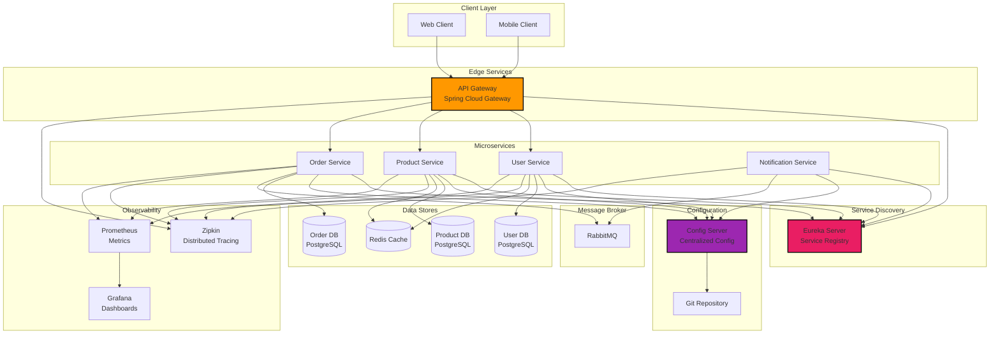
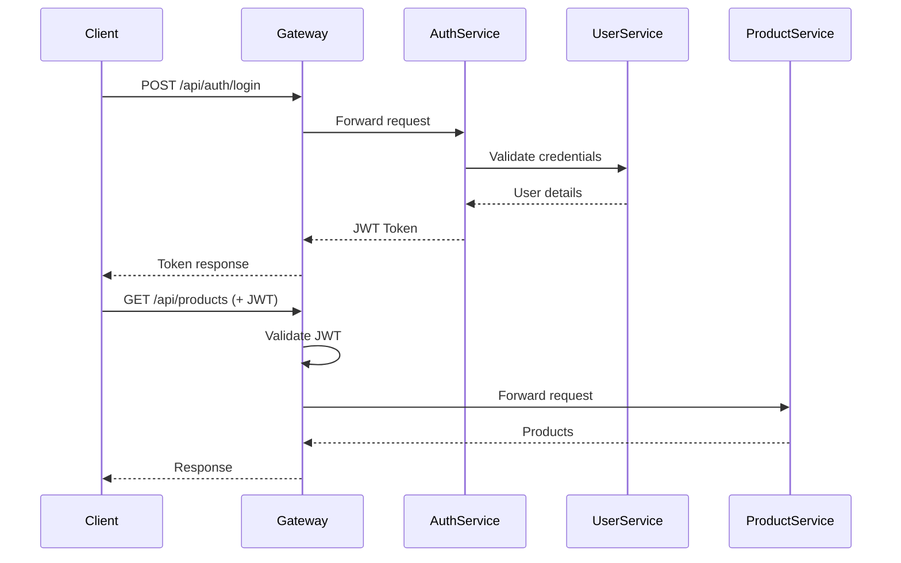

# ☁️ Spring Cloud Microservices Architecture

[](https://www.oracle.com/java/)
[](https://spring.io/projects/spring-cloud)
[](https://github.com/Netflix)
[](https://www.docker.com/)

> Complete microservices architecture built with Spring Cloud, featuring Service Discovery (Eureka), API Gateway, Config Server, Circuit Breaker, and Distributed Tracing.

---

## 🎯 Architecture Overview

This project demonstrates a **production-grade microservices architecture** implementing industry best practices and patterns.



---

## ✨ Features

### 🔍 Service Discovery
- ✅ **Eureka Server** for dynamic service registration
- ✅ **Client-side load balancing** with Spring Cloud LoadBalancer
- ✅ **Health checks** and automatic de-registration
- ✅ **Self-preservation mode** for resilience

### 🚪 API Gateway
- ✅ **Spring Cloud Gateway** as entry point
- ✅ **Request routing** to microservices
- ✅ **Load balancing** across service instances
- ✅ **Rate limiting** and throttling
- ✅ **CORS configuration**
- ✅ **JWT authentication** filter

### ⚙️ Configuration Management
- ✅ **Spring Cloud Config Server**
- ✅ **Git-backed** configuration repository
- ✅ **Environment-specific** configs (dev, staging, prod)
- ✅ **Refresh configurations** without restart
- ✅ **Encryption/Decryption** of sensitive data

### 🔄 Resilience Patterns
- ✅ **Circuit Breaker** with Resilience4j
- ✅ **Retry mechanism** for failed requests
- ✅ **Fallback methods** for degraded responses
- ✅ **Bulkhead** pattern for isolation
- ✅ **Rate limiting** per service

### 📊 Observability
- ✅ **Distributed Tracing** with Zipkin/Jaeger
- ✅ **Metrics** with Micrometer + Prometheus
- ✅ **Dashboards** with Grafana
- ✅ **Centralized Logging** with ELK Stack ready
- ✅ **Health indicators** with Spring Boot Actuator

### 📬 Asynchronous Communication
- ✅ **RabbitMQ** message broker
- ✅ **Event-driven architecture**
- ✅ **Dead Letter Queues**
- ✅ **Message acknowledgment** patterns

---

## 🏗️ Microservices

### 1. Config Server (Port: 8888)
Centralized configuration management using Git repository.

**Features:**
- Environment-specific configurations
- Encryption for sensitive data
- Refresh without restart

### 2. Eureka Server (Port: 8761)
Service discovery and registry.

**Features:**
- Dynamic service registration
- Health checks
- Service metadata
- Dashboard UI

### 3. API Gateway (Port: 8080)
Entry point for all client requests.

**Features:**
- Request routing
- Load balancing
- Authentication/Authorization
- Rate limiting
- CORS handling

### 4. User Service (Port: 8081)
Manages user accounts and authentication.

**Tech Stack:**
- Spring Boot 3.2
- Spring Security
- PostgreSQL
- Redis Cache

### 5. Product Service (Port: 8082)
Handles product catalog and inventory.

**Tech Stack:**
- Spring Boot 3.2
- Spring Data JPA
- PostgreSQL
- Redis Cache

### 6. Order Service (Port: 8083)
Processes customer orders.

**Tech Stack:**
- Spring Boot 3.2
- Spring Data JPA
- PostgreSQL
- RabbitMQ

### 7. Notification Service (Port: 8084)
Sends notifications via email/SMS.

**Tech Stack:**
- Spring Boot 3.2
- RabbitMQ Consumer
- Email/SMS integrations

---

## 🛠️ Technology Stack

| Component | Technology | Purpose |
|-----------|-----------|---------|
| **Language** | Java 17 | Programming language |
| **Framework** | Spring Boot 3.2 | Microservice framework |
| **Service Discovery** | Netflix Eureka | Service registry |
| **API Gateway** | Spring Cloud Gateway | Routing & filtering |
| **Config Management** | Spring Cloud Config | Centralized configuration |
| **Load Balancer** | Spring Cloud LoadBalancer | Client-side LB |
| **Circuit Breaker** | Resilience4j | Fault tolerance |
| **Tracing** | Zipkin / Jaeger | Distributed tracing |
| **Metrics** | Micrometer + Prometheus | Metrics collection |
| **Visualization** | Grafana | Metrics dashboards |
| **Message Broker** | RabbitMQ | Async messaging |
| **Databases** | PostgreSQL | Relational database |
| **Cache** | Redis | Distributed cache |
| **Containers** | Docker | Containerization |
| **Orchestration** | Docker Compose | Local orchestration |

---

## 📦 Installation

### Prerequisites
- Java 17+
- Docker & Docker Compose
- Maven 3.9+

### Quick Start with Docker

```bash
# Clone repository
git clone https://github.com/davidbadelllab/spring-cloud-microservices-architecture.git
cd spring-cloud-microservices-architecture

# Start all services
docker-compose up --build

# Services will be available at:
# - Eureka Dashboard: http://localhost:8761
# - API Gateway: http://localhost:8080
# - Config Server: http://localhost:8888
# - Zipkin UI: http://localhost:9411
# - RabbitMQ Management: http://localhost:15672 (guest/guest)
```

### Service Startup Order

The services start in the following order (managed by Docker Compose):

1. **Config Server** (8888)
2. **Eureka Server** (8761)
3. **Infrastructure** (PostgreSQL, Redis, RabbitMQ, Zipkin)
4. **Microservices** (User, Product, Order, Notification)
5. **API Gateway** (8080)

---

## 🚀 Usage

### Access Services via API Gateway

```bash
# Register user
curl -X POST http://localhost:8080/api/users/register \
  -H "Content-Type: application/json" \
  -d '{
    "username": "john.doe",
    "email": "john@example.com",
    "password": "SecurePass123!"
  }'

# Login
curl -X POST http://localhost:8080/api/auth/login \
  -H "Content-Type: application/json" \
  -d '{
    "email": "john@example.com",
    "password": "SecurePass123!"
  }'

# Get products
curl -X GET http://localhost:8080/api/products \
  -H "Authorization: Bearer {token}"

# Create order
curl -X POST http://localhost:8080/api/orders \
  -H "Authorization: Bearer {token}" \
  -H "Content-Type: application/json" \
  -d '{
    "productId": 1,
    "quantity": 2
  }'
```

### Monitor Services

```bash
# Check Eureka Dashboard
open http://localhost:8761

# View distributed traces in Zipkin
open http://localhost:9411

# Access RabbitMQ Management
open http://localhost:15672
# Username: guest
# Password: guest

# Prometheus metrics
curl http://localhost:8080/actuator/prometheus
```

---

## 📊 Monitoring & Observability

### Distributed Tracing with Zipkin

View request flows across microservices:
- Request/response times
- Service dependencies
- Error traces
- Performance bottlenecks

### Metrics with Prometheus & Grafana

Monitor:
- Request rates
- Error rates
- Latency percentiles (p50, p95, p99)
- JVM metrics (heap, threads, GC)
- Database connection pool stats

---

## 🔐 Security

### JWT Authentication Flow



---

## 🧪 Testing

```bash
# Unit tests
mvn test

# Integration tests
mvn verify

# Specific service
cd user-service
mvn test

# With coverage
mvn test jacoco:report
```

---

## 📈 Best Practices Implemented

### Microservices Patterns
- ✅ **Database per Service** - Each microservice has its own database
- ✅ **API Gateway Pattern** - Single entry point for clients
- ✅ **Service Discovery** - Dynamic service location
- ✅ **Circuit Breaker** - Fault tolerance
- ✅ **Saga Pattern** - Distributed transactions (Order flow)
- ✅ **CQRS** - Command Query Responsibility Segregation
- ✅ **Event Sourcing** - Event-driven architecture

### Resilience
- ✅ **Retry with exponential backoff**
- ✅ **Circuit breaker** with Resilience4j
- ✅ **Bulkhead** for isolation
- ✅ **Rate limiting**
- ✅ **Timeout configuration**

### Observability
- ✅ **Distributed tracing** across services
- ✅ **Centralized logging** ready
- ✅ **Metrics collection** with Micrometer
- ✅ **Health checks** for each service
- ✅ **Custom business metrics**

---

## 🗺️ Roadmap

- [ ] Kubernetes deployment manifests
- [ ] Service Mesh with Istio
- [ ] GraphQL API Gateway option
- [ ] Kafka as alternative message broker
- [ ] Redis Cluster for caching
- [ ] ElasticSearch for centralized logging
- [ ] OAuth2/OIDC integration
- [ ] gRPC communication between services

---

## 👨‍💻 Author

**David Badell** - Software Architect
- GitHub: [@davidbadelllab](https://github.com/davidbadelllab)
- Email: davidbadell42@gmail.com

This project demonstrates expertise in:
- ✅ Microservices Architecture
- ✅ Spring Cloud Ecosystem
- ✅ Distributed Systems Design
- ✅ DevOps & Cloud-Native Applications
- ✅ Enterprise Java Patterns

---

<div align="center">

**⭐ If you found this architecture useful, give it a star! ⭐**


</div>
